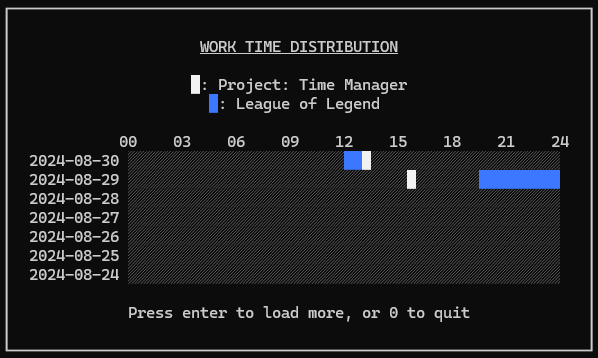

# Time Manager
A command-line program to track and manage how you spend your time running the manager. Easily monitor, record, and analyze your time usage directly from the terminal, helping you optimize productivity and stay organized.

# Author
2j2h5 | https://github.com/2j2h5

# What for?

You can monitor work time distribution like this.

# How to run?

You can use this program just run main.py. First, choose option 3 to add new work. If you successfully add work, then choose option 1 for working mode then log your work time. This log is saved by sqlite3 so monitor.db file created on root directory. Your works added are saved in work.db on root directory.
